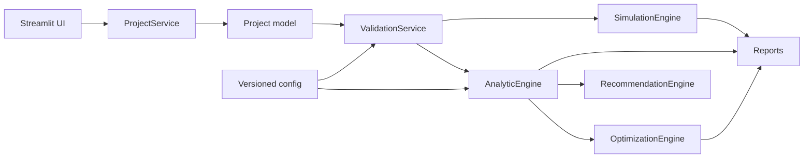

# Архитектура

## Слои

### `pages/`

Тонкий интерфейс: ввод, отображение, кнопки запуска и скачивания. Расчётных формул нет.

### `src/models/`

Pydantic-модели:

- проект, здание и зоны;
- этажи;
- лифты и группы;
- сценарии пассажиропотока;
- аналитические и симуляционные результаты;
- аудит и рекомендации.

### `src/services/`

- `configuration_service.py` — безопасная загрузка конфигураций;
- `formula_service.py` — единый реестр и матрица формул;
- `validation_service.py` — межмодельные проверки;
- `project_service.py` — JSON, миграция и стартовый проект.

### `src/engines/`

- `analytic_engine.py` — preview и шлюз нормативного метода;
- `simulation_engine.py` — детерминированная очередь событий;
- `optimization_engine.py` — перебор вариантов;
- `recommendation_engine.py` — прозрачные правила.

### `src/controllers/`

Стратегии назначения кабин. MVP использует ближайшую свободную кабину; базовая destination-control эвристика вынесена отдельно и не выдаётся за промышленный алгоритм.

### `src/reports/`

Независимые генераторы DOCX, PDF, XLSX и Plotly-графиков.

## Поток данных

## Воспроизводимость

Проект сериализуется канонически и хэшируется SHA-256. Результат симуляции сохраняет seed, число повторов и хэш. Повтор `r` использует seed `base_seed + r`.

## Расширение нормативного ядра

Новая формула добавляется одновременно в:

1. типизированную Python-функцию;
2. `config/formulas.yaml`;
3. нормативный критерий с применимостью;
4. unit-тест;
5. regression-тест по подтверждённому примеру.

Такой порядок не позволяет формуле существовать только как текст в отчёте.
